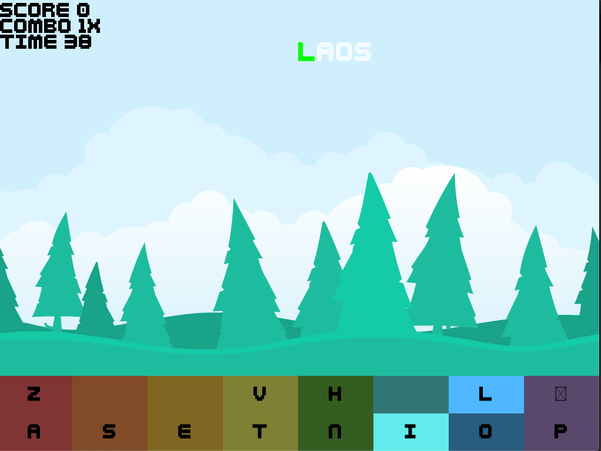
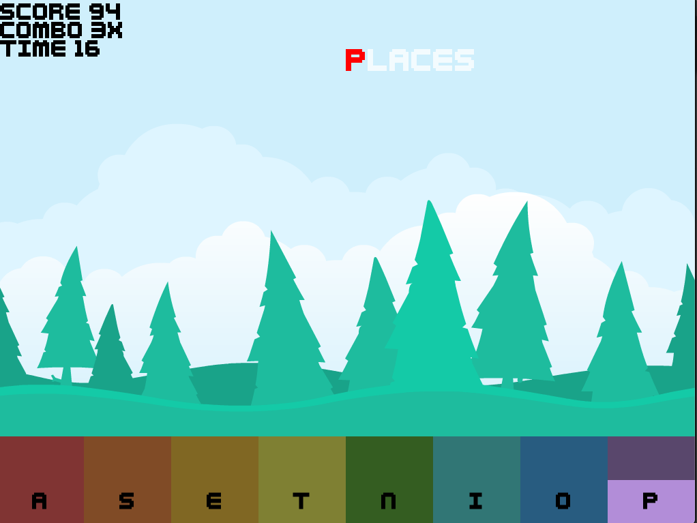
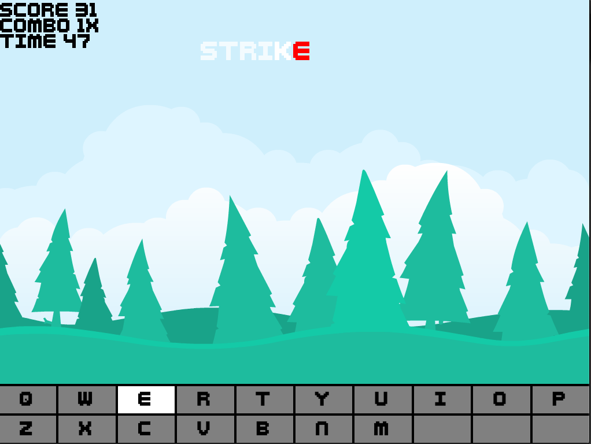

Fresh Keeb In LA
-----------------

This was originally made to (hopefully) learn you the strange keyboard layout called
[ASETNIOP](http://asetniop.com/). I've later added other layouts, as I wanted to test some more out. Your also free to
add your own strange layouts via pull requests!

## How to play

If you have [LÖVE](https://love2d.org/) installed on your compute, you probably know what to do (`love .`), others can
download the binaries from the [release-page](https://github.com/Kyrremann/asetniop-typing-game/releases).

## Keyboards/layouts

### ASETNIOP

Check out their website if you want to learn more. I made this game so I could have a fun use for my cool Ginni keyboard
from [gBoards.ca](https://www.gboards.ca/product/ginni).

If you have a Ginni you can download and flash the layout using
[chinatsu](https://github.com/chinatsu/qmk_firmware/tree/master/keyboards/ginni) QMK fork. Going to clean up the
firmware code before we ask to get it merged into the main QMK repo (that would be really cool!).

### Butterstick (chinatsu)

My friend's [butterstick](https://github.com/chinatsu/qmk_firmware/tree/master/keyboards/butterstick) layout.

To play, run `love . butterstick`!

## Screenshots

Here are two screenshots using the Ginni layout

 

Here is a screenshot using the Butterstick layout

## Credits

Thanks to who ever made ASETNIOP, and thanks to [Kenney](https://www.kenney.nl/) for the great free and open game
assets!
